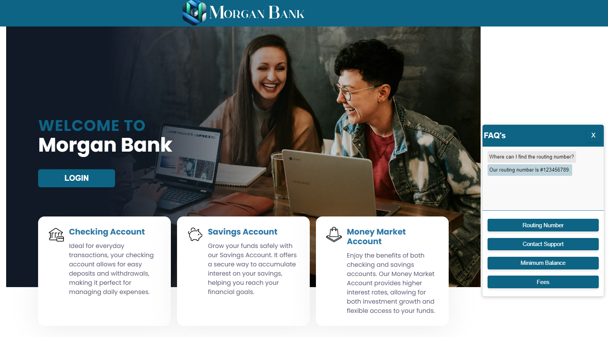
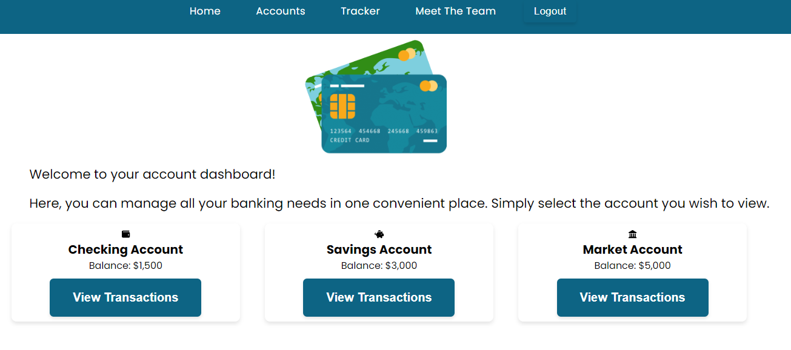
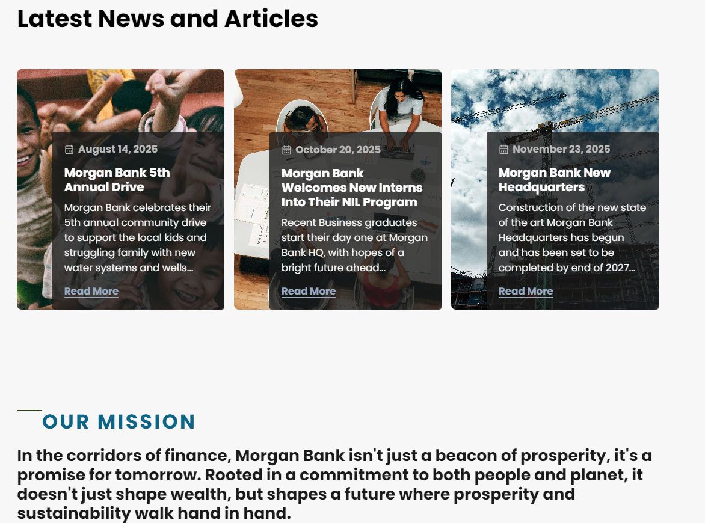

# MORGAN BANK WEB APPLICATION

The Morgan Bank application is a collaborative project designed to create an innovative money management app. In this project, I took the lead in designing, structuring, and coding the front end using the React framework. My focus was on delivering a user-friendly, interactive, and intuitive platform that enhances the user experience in managing their finances.

I prioritized user needs and incorporated the latest technology trends by implementing a chatbot that assists users with common questions. This feature ensures that users receive instant support, making it easier for them to navigate the app. Through thoughtful design and responsive features, the application provides a seamless interface for tracking spending, setting budgets, and achieving financial goals.

